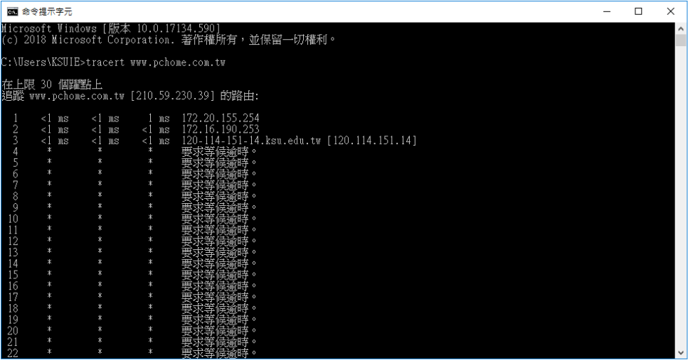
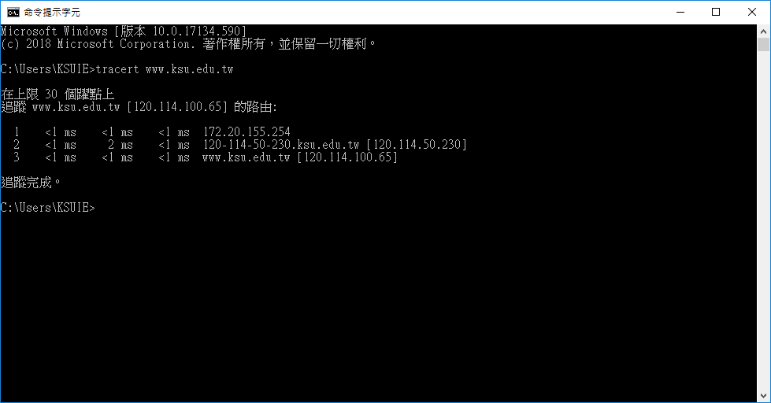

### markdown
```
https://markdown.tw/
```
### Network Types:
```
1. Personal Area Network (PAN)
2. Local Area Network (LAN)
3. Wireless Local Area Network (WLAN)
4. Campus Area Network (CAN)
5. Metropolitan Area Network (MAN)
6. Wide Area Network (WAN)
7. Storage-Area Network (SAN)
8. System-Area Network (also known as SAN)
9. Passive Optical Local Area Network (POLAN)
10. Enterprise Private Network (EPN)
11. Virtual Private Network (VPN)
```
### Network Topologies
```
Types of Network Topology
BUS Topology
RING Topology
STAR Topology
MESH Topology
MESH Topology: Routing
MESH Topology: Flooding
TREE Topology
HYBRID Topology
```
```
What is a DMZ? (Demilitarized Zone)
https://www.youtube.com/watch?v=dqlzQXo1wqo
```
```
NAT Explained - Network Address Translation
https://www.youtube.com/watch?v=FTUV0t6JaDA
```
# 網路硬體

```
Layer-1:repeater(1-1), hub(1-N)
Layer-2:bridgr, switch
Layer-3: router,L3-Switch
Layer-4: L4 switch
Layer-7: L7 switch, proxy
```


# 網路協定:

### OSI MODEL
```
OSI Model Explained | OSI Animation | Open System Interconnection Model | OSI 7 layers | TechTerms
https://www.youtube.com/watch?v=vv4y_uOneC0
```

### TCP/IP
```

```

### IEEE 802
```
https://zh.wikipedia.org/wiki/IEEE_802
```
```
IEEE 802中定義的服務和協定限定在OSI模型的最低兩層（即實體層和資料鏈路層）。

IEEE 802將OSI的資料鏈路層分為兩個子層:

Layer-2: 資料鏈路層===>  邏輯鏈路控制（LLC, Logical Link Control）
                媒介存取控制（MAC, Media Access Control）
Layer-1: 實體層
```
```
區域網路用的協定:
IEEE 802.1：高層區域網路協定（Bridging (networking) and Network Management）
IEEE 802.2：邏輯鏈路控制（Logical link control）
[超級重要] IEEE 802.3：乙太網路（Ethernet）
IEEE 802.4：權杖匯流排（Token bus）
IEEE 802.5：權杖環（Token-Ring）
IEEE 802.6：城域網（MAN, Metropolitan Area Network）
IEEE 802.7：寬頻TAG（Broadband LAN using Coaxial Cable）
IEEE 802.8：光纖分散式資料介面（FDDI）
IEEE 802.9：綜合業務區域網路（Integrated Services LAN）
IEEE 802.10：區域網路網路安全（Interoperable LAN Security）
[超級重要] IEEE 802.11：無線區域網路（Wireless LAN & Mesh）
IEEE 802.12：需求優先級（Demand priority）
IEEE 802.13：（未使用）
IEEE 802.14：電纜數據機（Cable modems）
IEEE 802.15：無線個人區域網路（Wireless PAN）
IEEE 802.15.1：無線個人區域網路絡（WPAN, Wireless Personal Area Network）
IEEE 802.15.4：低速無線個人區域網路絡（LR-WPAN, Low Rate Wireless Personal Area Network）
IEEE 802.16：寬頻無線接入（Broadband Wireless Access）
IEEE 802.17：彈性封包環傳輸技術（Resilient packet ring）
IEEE 802.18：無線電管制技術（Radio Regulatory TAG）
IEEE 802.19：共存標籤（Coexistence TAG）
IEEE 802.20：移動寬頻無線接入（Mobile Broadband Wireless Access）
IEEE 802.21：媒介獨立換手（Media Independent Handover）
IEEE 802.22：無線區域網（Wireless Regional Area Network）
IEEE 802.23：緊急服務工作群組（Emergency Services Working Group），2010年3月新發布
```
# TCP/IP協定


# 網際層（Internet Layer）[OSI 參考模式的網路層]協定:
```
● IP（Internet Protocol）：網際通訊協定。
● ARP（Address Resolution Protocol）：位址解析協定。
● RARP（Reverse Address Resolution Protocol）：反向位址解析協定。
```
### ARP
```
Address Resolution Protocol (ARP) - Explained with example | Computer network | TechTerms
https://www.youtube.com/watch?v=EC1slXCT3bg

MAC Address

位址解析協定（Address Resolution Protocol, ARP）來查問欲傳送之目的主機的MAC位址==已知的 IP 位址查問其相對應的網路實體位
反向位址解析協定（Reverse Address Resolution Protocol, RARP）。由已知的網路實體位址查詢其相對應的 IP 位址
```

```
arp /?

顯示和修改位址解析通訊協定 (ARP) 使用的 IP 對實際位址{MAC address}轉譯表格。

ARP -s inet_addr eth_addr [if_addr]
ARP -d inet_addr [if_addr]
ARP -a [inet_addr] [-N if_addr] [-v]

  -a            質詢目前的通訊協定資料來顯示目前的
                ARP 項目。如果指定 inet_addr，只會顯示指定電腦的
                IP 及實體位址。如果有多個網路介面使用 ARP，便 會顯示每個 ARP
                表格的項目。
  -g            與 -a 相同。
  -v            以詳細資訊模式顯示目前的 ARP 項目。將會顯示
                所有無效項目和回路介面上的項目。
  inet_addr     指定網際網路位址。
  -N if_addr    顯示 if_addr 指定之網路介面的 ARP
                項目。
  -d            刪除 inet_addr 指定的主機。使用萬用字元 * 取代 inet_addr
                可刪除所有主機。
  -s            新增主機並將網際網路位址 inet_addr 與實體位址
                eth_addr 相關聯。實體位址是
                6 個以連字號分隔的十六進位位元組。該項目
                永久不變。
  eth_addr      指定實體位址。
  if_addr       如果存在，這會指定介面的網際網路位址，
                應修改此介面的位址轉譯表格。
                如果不存在，將會使用第一個適用的介面。
範例:
  > arp -s 157.55.85.212   00-aa-00-62-c6-09  .... 新增靜態項 目。
  > arp -a                                    .... 顯示 ARP 表格。
```
### ICMP
```
Internet Control Message Protocol
```
#### ICMP Message Format封包格式:


```
ICMP 封包格式，其各欄位功能如下：
● 訊息型態（Message Type）：表示該 ICMP 所欲控制之訊息型態，共有 13 種型態，訊息型態之型態代表值如表 5-2 所示。
● 編碼（Code）：對各種訊息型態進一步說明工作內容。
● 檢查集檢查碼（Checksum）：對該封包檢查集錯誤偵測。
● 訊息說明（Message description）：依照不同的控制訊息，而有不同的說明方式。
```
#### Message Type
```
ICMP 訊息功能

[重要]0  Echo Reply（回應答覆）
[重要]3  Destination Unreachable（目的地無法到達）

4 Source Quench（來源抑制）

[重要]5 Redirect（改變傳輸路徑）

[重要]8 Echo Request（回應要求）

9 Router Advertisement（路由器宣傳）
10 Router Solicitation（路由器懇請）
11 Time Exceeded for a Datagram（溢時傳輸）
12 Parameter Problem on a Datagram（參數問題）
13 Timestamp Request（時間標籤要求）
14 Timestamp Reply（時間標籤回覆）
15 Information Request（資訊要求）（停用）
16 Information Reply（資訊回覆）（停用）
17 Address Mask Request（位址遮罩要求）
18 Address Mask Reply（位址遮罩回覆）
```
### Type=3[Destination Unreachable（目的地無法到達）]的 code欄位
```
 Code 欄位:註明無法到達目的地的原因：
● 0: Network Unreachable（無法到達目的網路）
● 1: Host Unreachable（無法到達目的主機）
● 2: Protocol Unreachable（通訊協定不存在）
● 3: Port Unreachable（無法到達連接埠）
● 4: Fragmentation Needed and DF set（資料需分割並設定不可分割位元）
● 5: Source Route Failed（來源路徑選擇失敗）
● 6: Destination Network Unknown（無法識別目的地網路）
● 7: Destination Host Unknown（無法識別目的地主機）
● 8: Source Host Isolated（來源主機被隔離）
● 9: Communication with Destination Network Administratively Prohibited（管理上禁止和目的地網路通訊）
● 10: Communication with Destination Host Administratively Prohibited（管理上禁止和目的地主機通訊）
● 11: Network Unreachable for Type of Service（無法到達此型態的網路服務）
● 12: Host Unreachable for Type of Service（無法到達此型態的主機服務）
```
### ICMP 封裝


### ICMP 常用指令
```
ping 
tracert| Traceroute
如何使用 TRACERT 疑難排解 Windows 中的 TCP/IP 問題
https://support.microsoft.com/zh-tw/help/314868/how-to-use-tracert-to-troubleshoot-tcp-ip-problems-in-windows
```

```
作業:tracert www.ksu.edu.tw
```

### TCP vs UDP 
```
TCP vs UDP Comparison
https://www.youtube.com/watch?v=uwoD5YsGACg
```


### SSL, TLS, HTTP, HTTPS 
```
SSL, TLS, HTTP, HTTPS Explained
https://www.youtube.com/watch?v=hExRDVZHhig
```

###  Proxy Server
```
What is a Proxy Server?
https://www.youtube.com/watch?v=5cPIukqXe5w
```

### FTP (File Transfer Protocol), SFTP, TFTP Explained.
```
FTP (File Transfer Protocol), SFTP, TFTP Explained.
https://www.youtube.com/watch?v=tOj8MSEIbfA
```

### DNS
```

```

### DNS
```

```

### DNS
```

```

